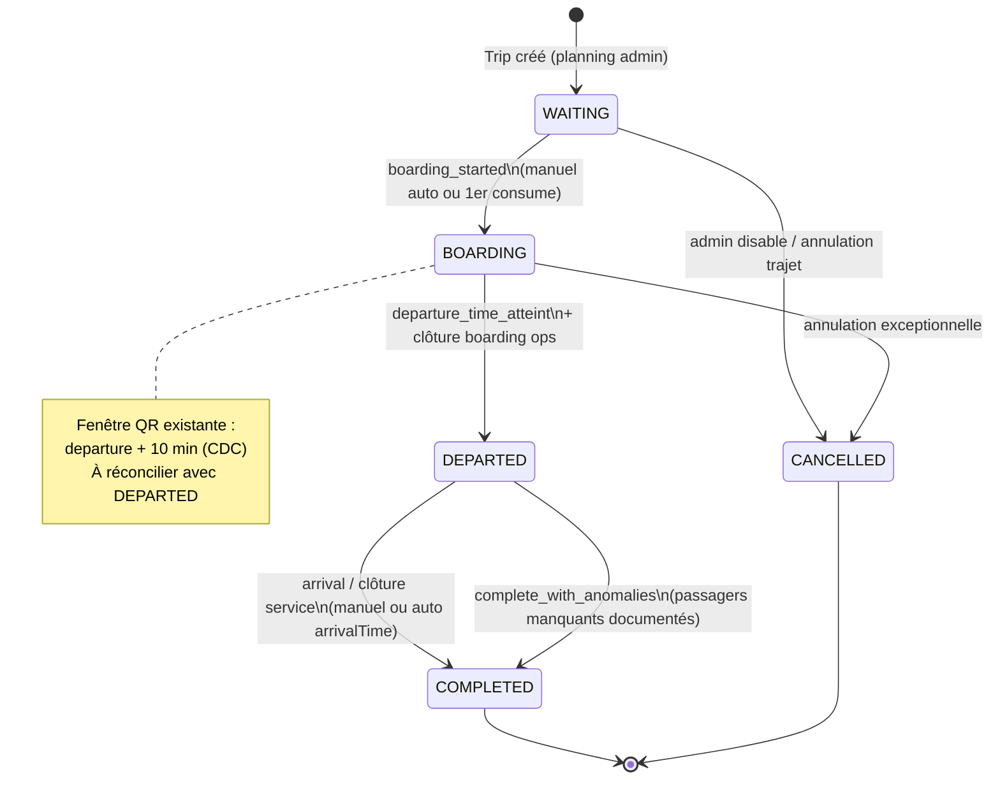

# OPS-03A — Audit lifecycle opérationnel d'un trajet

**Ticket :** OPS-03A  
**Phase BMAD :** OPS-03A (audit / architecture)  
**Date :** 2026-06-20  
**Rôle :** Product Architect + Backend Architect + Operations Lead  
**Statut :** Audit validé — **décisions CTO verrouillées** (voir §1.1) · implémentation **OPS-03B** en cours  
**Code modifié :** OPS-03A = doc seule · OPS-03B = backend lifecycle engine

### 1.1 Décisions CTO validées (2026-06-20)

| Décision | Choix retenu |
|----------|--------------|
| Mode | Lifecycle **manuel** (pas de transitions automatiques horloge) |
| États | `WAITING → BOARDING → DEPARTED → COMPLETED` + `CANCELLED` |
| Scan QR | Autorisé **uniquement** si `lifecycleStatus = BOARDING` |
| Fermeture embarquement | `DEPARTED` ferme l'embarquement (remplace la fenêtre grâce +10 min comme garde-fou principal) |
| Départ vide | **Autorisé** (`DEPARTED` sans passagers embarqués) |
| Départ incomplet | **Autorisé** (pas de blocage occupancy) |
| Migration historique | Tous les trajets existants → `WAITING` |
| Rôles lifecycle API | `ADMIN` + `SUPER_ADMIN` uniquement (pas de DRIVER autonome en V1) |
| **DEPARTED → CANCELLED** | **Volontairement interdit** — bus déjà parti = point de non-retour lifecycle ; seule issue : `COMPLETED` (annulation commerciale = runbook hors lifecycle V1) |
| **Réservations sur trip `CANCELLED`** | `cancelTrip()` ne modifie **pas** le statut des `Reservation` — les `CONFIRMED` payées restent en base ; scan bloqué par `TRIP_CANCELLED` ; remboursement / annulation résa = flux existant admin (hors scope 03B) |

---

## 1. Résumé exécutif

SharingGO dispose d'un **moteur trajet/réservation/boarding mature**, d'un **cockpit Departures** (readiness UX) et d'un **moteur incident OPS-02** — mais **aucun cycle de vie de départ persisté** au niveau `Trip`.

Aujourd'hui, l'exploitation infère l'état d'un départ via :

1. **Occupancy** (`confirmed` / `used` / `pending`) — vérité réservations ;
2. **Heuristiques frontend** (`WAITING_PASSENGERS`, `BOARDING_IN_PROGRESS`, `READY`, …) — **non contractuelles** ;
3. **Horloge** (`departureTime`, fenêtre QR +10 min) — règles boarding ;
4. **Soft disable** (`Trip.deletedAt`) — annulation administrative, pas lifecycle.

Le gap principal : les états cibles **DEPARTED** et **COMPLETED** n'existent ni en DB ni en API. La transition **WAITING → BOARDING** est **implicite** (premier `consume`), jamais enregistrée comme événement métier trajet.

**Recommandation OPS-03B :** introduire un **`TripLifecycleStatus` persisté** (ou table d'événements) avec machine à états explicite, tout en **conservant** l'occupancy comme source de vérité passagers et les incidents OPS-02 comme couche parallèle non bloquante.

---

## 2. Périmètre et mapping terminologique

### 2.1 États cibles produit (OPS-03)

| État cible | Intention métier |
|------------|------------------|
| **WAITING** | Départ planifié ; passagers peuvent réserver ; embarquement pas encore commencé (ou pas encore actif côté ops). |
| **BOARDING** | Phase d'embarquement QR active ; au moins un scan/consume en cours ou attendu. |
| **DEPARTED** | Heure de départ atteinte ; navette partie ou considérée en route ; fin logique de l'embarquement (sous réserve fenêtre grâce). |
| **COMPLETED** | Service du trajet terminé ; plus d'action opérationnelle ; archivage exploitation. |

### 2.2 États existants aujourd'hui (réel code)

| Couche | Symbole / champ | Persisté ? | Fichier / source |
|--------|-----------------|------------|------------------|
| **Trip** | `departureTime`, `arrivalTime` | ✅ | `schema.prisma` · `Trip` |
| **Trip** | `deletedAt` (disable) | ✅ | soft delete admin |
| **Trip** | *aucun `lifecycleStatus`* | ❌ | — |
| **Reservation** | `PENDING` → `CONFIRMED` → `USED` | ✅ | `ReservationStatus` |
| **Departures UX** | `WAITING_PASSENGERS` | ❌ | `departure-readiness.ts` |
| **Departures UX** | `BOARDING_IN_PROGRESS` | ❌ | idem |
| **Departures UX** | `READY` | ❌ | idem |
| **Departures UX** | `EMPTY`, `UNKNOWN` | ❌ | idem |
| **Types futurs** | `DEGRADED`, `DELAYED`, `INCIDENT`, `CLOSED` | ❌ (types TS seulement) | `departures.types.ts` |

### 2.3 Table de correspondance approximative

| État OPS-03 cible | Proxy actuel le plus proche | Écart |
|-------------------|----------------------------|-------|
| WAITING | `WAITING_PASSENGERS` ou `EMPTY` | UX only ; `EMPTY` = zéro occupé |
| BOARDING | `BOARDING_IN_PROGRESS` ou `READY` | `READY` = tous occupés embarqués mais pas « parti » |
| DEPARTED | *aucun* | `departureTime <= now` utilisé pour **bloquer réservation**, pas pour statut ops |
| COMPLETED | *aucun* | `arrivalTime` optionnel, jamais piloté par workflow |

---

## 3. State machine cible (proposition OPS-03B)

### 3.1 Diagramme transitions (états persistés futurs)



### 3.2 Transitions autorisées (matrice)

| De \ Vers | WAITING | BOARDING | DEPARTED | COMPLETED | CANCELLED |
|-----------|---------|----------|----------|-----------|-----------|
| **WAITING** | — | ✅ | ⚠️ auto urgence | ❌ | ✅ |
| **BOARDING** | ❌ | — | ✅ | ❌ | ✅ |
| **DEPARTED** | ❌ | ❌ | — | ✅ | ❌ |
| **COMPLETED** | ❌ | ❌ | ❌ | — | ❌ |
| **CANCELLED** | ❌ | ❌ | ❌ | ❌ | — |

Légende :

- ✅ transition métier normale (OPS-03B) ;
- ⚠️ cas limite (départ sans boarding explicite — départ vide) ;
- ❌ interdit.

### 3.3 Règles métier proposées (à valider CTO en 03B)

| ID | Règle |
|----|-------|
| R1 | **WAITING** : `departureTime > now` ET aucun `Reservation.USED` sur le trajet (ou boarding non ouvert ops). |
| R2 | **BOARDING** : au moins un `USED` OU événement `boarding_started` explicite ; fenêtre QR ouverte (`departure + 10 min`). |
| R3 | **DEPARTED** : `now >= departureTime` ET boarding clôturé ops (ou grace QR expirée). |
| R4 | **COMPLETED** : action admin/auto après `arrivalTime` ou bouton « Clôturer service ». |
| R5 | **CANCELLED** : `Trip.deletedAt != null` OU statut dédié — **distinguer** disable planning vs annulation jour J. |
| R6 | Occupancy reste **source passagers** ; lifecycle **source état opérationnel trajet**. |
| R7 | Un incident OPEN **n'empêche pas** la transition (OPS-02) ; il **documente** l'anomalie. |
| R8 | Passager `CONFIRMED` non embarqué à DEPARTED → no-show / incident `NO_SHOW` (runbook, pas blocage auto V1). |

---

## 4. États existants — inventaire détaillé

### 4.1 Modèle `Trip` (Prisma)

```prisma
model Trip {
  id            String
  lineId        String
  driverId      String?
  departureTime DateTime
  arrivalTime   DateTime?
  totalSeats    Int @default(8)
  deletedAt     DateTime?   // soft disable — PAS lifecycle
  reservations  Reservation[]
  pendingReservations PendingReservation[]
}
```

**Constat :** aucune colonne `status`, `lifecycleStatus`, `boardedAt`, `departedAt`, `completedAt`.

### 4.2 Réservations (vérité passagers)

| Statut | Rôle lifecycle |
|--------|----------------|
| `PENDING` | Hold 2 min — occupe capacité via `PendingReservation` |
| `CONFIRMED` | Payé / confirmé — éligible QR |
| `USED` | Embarqué (`usedAt`, `usedByUserId`) |
| `CANCELED` / `EXPIRED` | Hors flux départ |

**Transition clé boarding :** `POST /api/boarding/consume` → `CONFIRMED → USED` (transaction + verrou).

### 4.3 Readiness Departures (UX — F3-T7)

Calcul : `frontend/src/features/departures/utils/departure-readiness.ts`

| Readiness UX | Condition |
|--------------|-----------|
| `EMPTY` | `occupiedSeats === 0` |
| `WAITING_PASSENGERS` | `usedSeats === 0` et (`confirmed > 0` ou `pending actifs`) |
| `BOARDING_IN_PROGRESS` | `usedSeats > 0` et `confirmed > 0` |
| `READY` | `usedSeats > 0` et `confirmed === 0` |
| `UNKNOWN` | occupancy indisponible |

**Garde UX :** jamais `READY` si `boardedCount === 0` → forcé `WAITING_PASSENGERS` (`departure-board.ts`).

**Boarding complete (affichage) :** `occupiedSeats === usedSeats > 0` — **ne déclenche pas** COMPLETED.

### 4.4 Fenêtre boarding QR (backend)

| Constante | Valeur | Fichier |
|-----------|--------|---------|
| `BOARDING_GRACE_MS` | 10 min après `departureTime` | `boarding.constants.ts` |
| Expiration JWT passager | alignée départ + 10 min | CDC · `boarding.service.ts` |

**Règles consume :** `boarding-eligibility.ts`

- Trip non disabled ;
- `CONFIRMED` + `Payment.SUCCEEDED` ;
- Fenêtre ouverte ;
- Token valide.

**Conséquence lifecycle :** un trajet peut être **« parti »** (`departureTime` passé) tout en acceptant encore des scans pendant **10 minutes** — tension à résoudre entre état **DEPARTED** et fenêtre technique.

### 4.5 Désactivation trajet (≠ lifecycle)

| Action | API | Effet |
|--------|-----|-------|
| Disable | `POST /api/transport/trips/:id/disable` | `deletedAt` set |
| Enable | `POST /api/transport/trips/:id/enable` | `deletedAt` null |

Effets collatéraux :

- Réservation : `TRIP_DISABLED` si `deletedAt` ;
- Boarding : `TRIP_DISABLED` ;
- Incidents : création possible avec `allowDisabled: true` (OPS-02B).

---

## 5. États manquants

| État / capacité | Manquant | Impact exploitation |
|-----------------|----------|---------------------|
| **DEPARTED** persisté | ✅ gap | Ops ne sait pas « le bus est parti » dans la DB |
| **COMPLETED** persisté | ✅ gap | Pas de fin de service ; Departures montre toujours des cartes |
| **BOARDING** explicite (horodaté) | ✅ gap | Inféré par premier `USED` seulement |
| **CANCELLED** jour J vs disable | ⚠️ ambigu | `deletedAt` mélange annulation planning et ops |
| **DELAYED** | ✅ gap | Retard = incident `DELAY` ou PATCH `departureTime`, pas état |
| **Realtime / event sourcing** | ✅ gap | Pas d'événement `TRIP_DEPARTED` en audit standardisé |
| **Filtre Departures post-service** | ✅ gap | `upcomingOnly` masque partiellement, pas de section COMPLETED |

---

## 6. API impactées (inventaire — aucune modification OPS-03A)

### 6.1 APIs existantes consommées par le lifecycle implicite

| API | Rôle lifecycle actuel | Impact OPS-03B prévu |
|-----|----------------------|----------------------|
| `GET /api/admin/trips` | Liste trajets + `deletedAt` | Lire / filtrer par `lifecycleStatus` |
| `GET /api/admin/trips/:id/occupancy` | Compteurs boarding | Inchangé (source passagers) |
| `POST /api/transport/trips` | Création → WAITING implicite | Initialiser statut WAITING |
| `PATCH /api/transport/trips/:id` | Modifier horaires | Recalcul transitions / incidents retard |
| `POST /api/transport/trips/:id/disable` | Annulation soft | Mapper vers CANCELLED ? |
| `POST /api/boarding/validate` | Pré-contrôle QR | Garder règles fenêtre + statut BOARDING |
| `POST /api/boarding/consume` | `CONFIRMED→USED` | Déclencheur candidat BOARDING |
| `POST /api/boarding/field-incidents` | Incident terrain | Parallèle — pas de transition |
| `POST /api/admin/incidents/promote-heuristic` | Anomalie départ | Parallèle — pas de transition |
| `GET /api/admin/incidents` | Liste par `relatedTripId` | Affichage contexte lifecycle |
| `GET /api/admin/activity-feed` | Audit boarding + incidents | Nouveaux events lifecycle |

### 6.2 APIs absentes (à concevoir OPS-03B)

| API proposée | Action |
|--------------|--------|
| `POST /api/admin/trips/:id/lifecycle/boarding-open` | Ouvrir boarding ops (optionnel si auto) |
| `POST /api/admin/trips/:id/lifecycle/depart` | Marquer DEPARTED |
| `POST /api/admin/trips/:id/lifecycle/complete` | Marquer COMPLETED |
| `GET /api/admin/trips/:id/lifecycle` | État + historique transitions |

> **Note OPS-03A :** ces routes sont **hors scope** — listées pour préparation 03B uniquement.

---

## 7. Tables impactées (inventaire)

| Table | Champs actuels lifecycle | Évolution 03B (proposition) |
|-------|-------------------------|----------------------------|
| **`Trip`** | `departureTime`, `arrivalTime`, `deletedAt` | `lifecycleStatus`, `boardingOpenedAt`, `departedAt`, `completedAt` |
| **`Reservation`** | `status`, `usedAt` | Probablement inchangé |
| **`PendingReservation`** | `expiresAt` | Inchangé |
| **`Incident`** | `relatedTripId`, `status` | Inchangé — lien contextuel |
| **`AuditLog`** | `TRIP_*`, `BOARDING_*` | `TRIP_LIFECYCLE_*` standardisés |
| **`WebhookEvent`** | Stripe | Hors lifecycle départ |

**Pas de migration en OPS-03A.**

---

## 8. UI impactées

| Surface | Comportement actuel | Impact lifecycle |
|---------|---------------------|------------------|
| **`/departures`** | Readiness UX + promote incident | Badges lifecycle persistés ; masquer COMPLETED ; actions Depart/Complete |
| **`/boarding`** | Scan QR chauffeur | Bloquer si COMPLETED/CANCELLED ; message si DEPARTED hors grace |
| **`/incidents`** | Fiche trajet + filtres | Afficher lifecycle sur carte ; deep-link conservé |
| **`/activity`** | Boarding + incidents | Events `TRIP_DEPARTED`, `TRIP_COMPLETED` |
| **`/dispatch`** | Feed activité | Liens trajet enrichis |
| **`/dashboard`** | KPI boarding in progress | KPI par lifecycle |
| **`/trips`** (admin planning) | CRUD + disable | Indicateur lifecycle + transitions |
| **Passager** | QR + réservation | Fenêtre boarding inchangée (CDC) |

---

## 9. Compatibilité OPS-02 (Incident Engine)

| Point | Compatibilité | Détail |
|-------|---------------|--------|
| Création incident terrain | ✅ | Indépendant du lifecycle — `BOARDING_FIELD` |
| Promote heuristique Départs | ✅ | `DEPARTURE_HEURISTIC` — anomalies pré-DEPARTED |
| Dedup 409 promote | ✅ | Par `heuristicKind` + trip OPEN incident |
| Résolution / clôture incident | ✅ | Ne modifie pas le trajet |
| Activity feed | ✅ | Ajout futur events lifecycle sans casser dedup incident |
| Assignation incident | ✅ | Orthogonal |

**Principe :** OPS-03 **ne remplace pas** OPS-02. Les incidents **documentent** ; le lifecycle **structure** le temps opérationnel.

**Heuristiques → lifecycle :**

| Heuristique Departures | Phase lifecycle concernée |
|------------------------|---------------------------|
| `no_passengers` | WAITING (départ vide) |
| `no_boarding_activity` | WAITING → BOARDING (retard embarquement) |
| `boarding_late` | BOARDING (post `departureTime`) |
| `full_not_boarded` | BOARDING (pression capacité) |
| `near_departure` | WAITING / BOARDING |

---

## 10. Interaction QR Boarding

### 10.1 Flux actuel

```text
Passager CONFIRMED + paiement OK
        ↓
JWT QR (exp = departure + 10 min)
        ↓
Chauffeur validate → consume
        ↓
Reservation USED (usedAt, usedByUserId)
        ↓
Occupancy : confirmed--, used++
        ↓
Readiness UX recalculé (pas de statut Trip)
```

### 10.2 Points de contact lifecycle futur

| Événement | Déclencheur actuel | Candidat transition OPS-03 |
|-----------|-------------------|---------------------------|
| Ouverture boarding | Premier `consume` (implicite) | → BOARDING |
| Embarquement en cours | `used > 0` && `confirmed > 0` | maintien BOARDING |
| Tous embarqués | `READY` / boarding complete | toujours BOARDING jusqu'à DEPARTED |
| Départ horaire | `now >= departureTime` | → DEPARTED (après grace policy) |
| Fin grace QR | `now > departure + 10 min` | verrouillage scans → DEPARTED ferme |
| Fin service | *aucun* | → COMPLETED |

### 10.3 Règles CDC à préserver

- JWT QR : expiration **+10 min après départ** ;
- 8 places / trajet ;
- Pas de panier ;
- Paiement webhook seul pour CONFIRMED.

---

## 11. Cas limites

### 11.1 Départ vide (`EMPTY`)

| Aspect | Comportement actuel | Risque OPS-03 |
|--------|---------------------|---------------|
| Occupancy | `occupiedSeats === 0` | Trajet peut passer à DEPARTED/COMPLETED sans BOARDING |
| Heuristique | `no_passengers` | Promote incident possible |
| Booking | Bloqué si `departureTime <= now` | Cohérent |

**Proposition :** WAITING → DEPARTED → COMPLETED sans passer par BOARDING si aucune réservation.

### 11.2 Départ annulé / désactivé

| Mécanisme | Champ | Lifecycle futur |
|-----------|-------|-----------------|
| Admin disable | `deletedAt` | Mapper **CANCELLED** (ou statut distinct `DISABLED_PLANNING`) |
| Avant départ | disable bloque booking + boarding | OK |
| Après embarquements | disable rare — réservations USED restent | Documenter runbook |

### 11.3 Départ incomplet (passagers manquants)

**Scénario :** `departureTime` atteint, `confirmedSeats > 0`, `usedSeats < occupiedSeats`.

| Aujourd'hui | Heuristique `boarding_late`, `full_not_boarded` |
|-------------|--------------------------------------------------|
| OPS-02 | Incident promote ou terrain |
| OPS-03B | Transition DEPARTED **autorisée** avec anomalies ; incidents NO_SHOW |

### 11.4 Retards

| Mécanisme | Existant |
|-----------|----------|
| Modifier horaire | `PATCH /api/transport/trips/:id` |
| Incident | `type: DELAY` |
| État `DELAYED` | Type TS futur seulement |

**Gap :** pas de recalcul automatique readiness/lifecycle sur PATCH — à spécifier en 03B.

### 11.5 Course pending active au départ

**Cas :** `activePendingSeats > 0` à `departureTime`.

- Occupancy compte pending dans `occupiedSeats` ;
- Readiness peut afficher `READY` si `used > 0`, `confirmed = 0` mais pending > 0 (OPS-01 risque UX) ;
- Lifecycle doit **ne pas** supposer « tous embarqués » sur READY seul.

### 11.6 Trajet disabled avec incidents ouverts

- OPS-02B : incidents créables sur trajet disabled (`allowDisabled: true`) ;
- Boarding : refusé (`TRIP_DISABLED`) ;
- Lifecycle CANCELLED ne doit pas effacer incidents.

### 11.7 Double consume / boarding après DEPARTED

- `BOARDING_ALREADY_USED` si JWT encore valide sur réservation USED ;
- Après grace : `BOARDING_WINDOW_EXPIRED` ;
- Lifecycle DEPARTED doit aligner messages chauffeur.

---

## 12. Diagramme — vue couches (as-is)

```text
┌─────────────────────────────────────────────────────────────┐
│                    COUCHES AUJOURD'HUI                       │
├─────────────────────────────────────────────────────────────┤
│  UI Departures     WAITING_PASSENGERS / BOARDING_IN_PROGRESS │
│  (UX only)         READY / EMPTY / UNKNOWN                   │
├─────────────────────────────────────────────────────────────┤
│  Incidents OPS-02  OPEN incidents · heuristiques promote    │
├─────────────────────────────────────────────────────────────┤
│  Boarding QR       validate → consume · grace +10 min        │
├─────────────────────────────────────────────────────────────┤
│  Occupancy API     confirmed · used · pending · occupied     │
├─────────────────────────────────────────────────────────────┤
│  Trip DB           departureTime · deletedAt · NO lifecycle  │
└─────────────────────────────────────────────────────────────┘
```

---

## 13. Diagramme — vue cible (to-be OPS-03B)

```text
         Planning                    Jour J                         Fin
            │                          │                              │
            ▼                          ▼                              ▼
      ┌──────────┐   boarding_open   ┌──────────┐   depart_time   ┌──────────┐
      │ WAITING  │ ────────────────► │ BOARDING │ ──────────────► │ DEPARTED │
      └──────────┘   (auto/manuel)   └──────────┘   (+grace QR)   └────┬─────┘
            │                          │                              │
            │ cancel                     │ cancel                       │ complete
            ▼                          ▼                              ▼
      ┌──────────┐                ┌──────────┐                  ┌──────────┐
      │CANCELLED │                │CANCELLED │                  │COMPLETED │
      └──────────┘                └──────────┘                  └──────────┘

      ─ ─ ─ ─ ─ ─ ─ ─ ─ ─ ─ ─ ─ ─ ─ ─ ─ ─ ─ ─ ─ ─ ─ ─ ─ ─ ─ ─ ─ ─ ─ ─ ─
      Couche parallèle : Incidents OPS-02 (ne bloquent pas les flèches)
      Couche passagers : Reservation CONFIRMED / USED (occupancy)
```

---

## 14. Audit logs et traçabilité existants

| Action audit | Lié lifecycle ? |
|--------------|-----------------|
| `TRIP_CREATED` | Création — futur WAITING |
| `TRIP_UPDATED` | Horaires |
| `TRIP_DISABLED` / enable | Annulation soft |
| `BOARDING_CONSUMED` / `BOARDING_CONSUMPTION_FAILED` | Embarquement |
| `INCIDENT_CREATED` | Parallèle |

**Manquant :** `TRIP_BOARDING_OPENED`, `TRIP_DEPARTED`, `TRIP_COMPLETED`.

---

## 15. Références code et docs

| Document / module | Pertinence |
|-------------------|------------|
| `docs/qa/OPS-01-departures-counters-audit.md` | Compteurs, readiness, gap CLOSED |
| `docs/features/F3-T7-driver-readiness-departure-console.md` | Spec readiness UX |
| `docs/architecture/OPS-02B-technical-design.md` | Gate OPS-03 |
| `docs/prd/active/OPS-02-incident-management.md` | Incidents + tripId |
| `backend/prisma/schema.prisma` | Modèle Trip |
| `backend/src/modules/boarding/boarding-eligibility.ts` | Règles QR |
| `backend/src/modules/transport/trips.service.ts` | CRUD + disable |
| `frontend/src/features/departures/utils/departure-readiness.ts` | Heuristiques |

---

## 16. Questions ouvertes pour OPS-03B (décisions CTO)

| # | Question | Options |
|---|----------|---------|
| Q1 | BOARDING déclenché auto au 1er `consume` ou action chauffeur/admin ? | Auto (simple) · Manuel (contrôle) · Hybride |
| Q2 | DEPARTED vs grace QR 10 min | DEPARTED à T0 mais scans jusqu'à T+10 · ou DEPARTED à T+10 |
| Q3 | `deletedAt` = CANCELLED ou statut séparé ? | Unifier · Séparer planning disable / ops cancel |
| Q4 | COMPLETED auto sur `arrivalTime` ? | Cron · Manuel admin · Les deux |
| Q5 | Migration données historiques | Tous WAITING par défaut · Inférence depuis `usedAt` / `departureTime` |
| Q6 | Filtre occupancy `Payment.SUCCEEDED` | Aligner lifecycle sur paiements réels (OPS-01 P2) |

---

## 17. Critères de succès OPS-03B (preview)

- [ ] `Trip.lifecycleStatus` persisté et exposé API admin
- [ ] Transitions auditées (`AuditLog`)
- [ ] Departures affiche lifecycle **et** readiness occupancy
- [ ] Boarding respecte statuts terminaux
- [ ] Incidents OPS-02 inchangés fonctionnellement
- [ ] Tests intégration : vide · incomplet · retard · disable · grace QR

---

## 18. Livrable OPS-03A

| Élément | Statut |
|---------|--------|
| State machine complète | ✅ §3 |
| Diagramme transitions | ✅ §3.1 · §13 |
| Cas limites | ✅ §11 |
| États existants / manquants | ✅ §2 · §5 |
| API / tables / UI impactées | ✅ §6–8 |
| Compatibilité OPS-02 | ✅ §9 |
| Code / migration / routes | ❌ exclus (audit only) |

**Prochain ticket :** **OPS-03B** — design technique + PRD + migration + API lifecycle + UI Departures/Trips.

---

*Audit réalisé sans modification du dépôt applicatif (documentation seule).*
