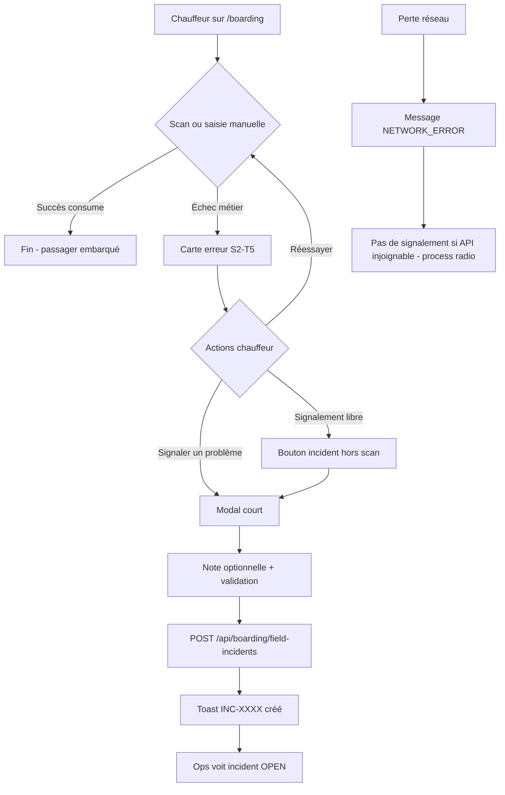
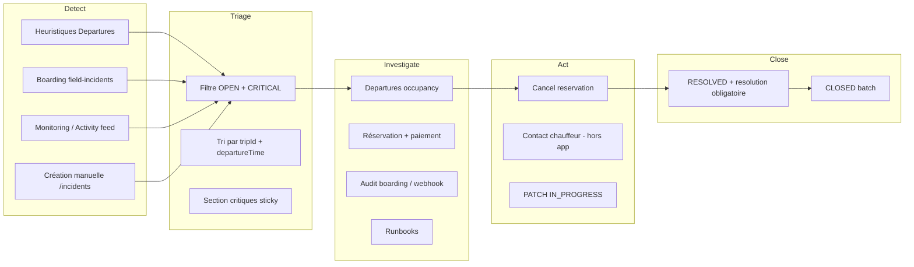
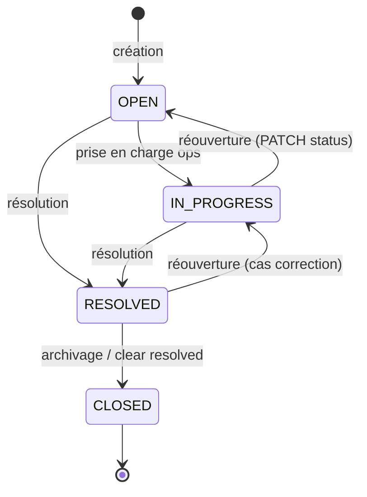

# PRD-OPS-02 — Incident Management (gestion incidents terrain)

**Status :** BUILD (OPS-02B backend livré — VERIFY en attente CTO)  
**Owner :** Product Owner · Operations Manager · Senior Backend Architect  
**Last updated :** 2026-06-20  
**Version :** v1.0  
**Ticket :** OPS-02A — Incident Management PRD  
**Prérequis :** OPS-01 DONE · OPS-02 audit validé · moteur boarding validé

> Méthodologie : [`docs/methodology/BMAD.md`](../../methodology/BMAD.md)  
> Produit global : [`docs/CAHIER_DES_CHARGES.md`](../../CAHIER_DES_CHARGES.md)  
> Audit source : [`docs/qa/OPS-02-incidents-functional-audit.md`](../../qa/OPS-02-incidents-functional-audit.md)  
> Socle existant : F3-T9-CORRECTION (incidents persistés admin)

---

# 1. Vision produit

SharingGO exploite une **ligne unique** Châlons-en-Champagne ↔ Paris-Vatry avec **8 trajets/jour** et **8 places** par créneau. Les incidents terrain (scan refusé, retard, panne, litige paiement, capacité) impactent directement la ponctualité, la sécurité passagers et la confiance Mosolf.

**Problème aujourd’hui :** le produit **rejette correctement** les cas métier (boarding S2-T5, webhooks Stripe, heuristiques Departures) mais **ne relie pas** ces signaux à un **workflow incident partagé** entre chauffeur et exploitation. L’opérateur doit interpréter badges UI, logs audit et créer manuellement un `INC-XXXX` — le chauffeur n’a **aucun canal applicatif** (téléphone implicite).

**Vision OPS-02 :** transformer le registre `Incident` existant en **boucle opérationnelle terrain → cockpit** :

1. **Détecter** — échec scan, alerte Departures, événement audit critique.
2. **Signaler** — chauffeur en 2 taps depuis boarding ; ops en 1 clic depuis Departures / Monitoring.
3. **Traiter** — triage par sévérité et trajet, investigation liée réservation/paiement.
4. **Clôturer** — résolution tracée, audit `INCIDENT_RESOLVED`, pas de suppression physique.

**Utilisateurs :**

| Persona | Besoin |
|---------|--------|
| **Chauffeur** (`DRIVER`) | Signaler un blocage sans quitter l’écran boarding |
| **Opérateur / dispatch** (`ADMIN`) | Voir incidents ouverts par trajet, agir (cancel, runbook) |
| **Super admin** (`SUPER_ADMIN`) | Vue globale, clôture, revue incidents critiques |
| **Passager** | Indirect — résolution plus rapide des litiges embarquement |

**Impact attendu :**

- Réduction du temps de escalade terrain → ops (cible : **&lt; 2 min** pour signalement chauffeur).
- Traçabilité partagée multi-opérateur (fin localStorage / téléphone seul).
- Base pour métriques ops (MTTR, top causes boarding) avant pilote réel.

**Principe directeur :** **étendre** le modèle `Incident` et les APIs admin — **pas** de ticketing enterprise, pas de refonte cockpit.

---

# 2. Objectifs MVP

Les objectifs MVP couvrent le **workflow chauffeur → exploitation** sur la base des **53 scénarios** audités, en priorisant les gaps P0/P1.

## Objectifs primaires (MVP — livraison OPS-02B + OPS-02C)

| ID | Objectif | Réf. audit |
|----|----------|------------|
| O1 | Permettre au **chauffeur** de créer un incident lié à un échec scan ou signalement libre, **sans accès admin** | B01–B15, gap M4 |
| O2 | **Lier systématiquement** les incidents terrain à un `relatedTripId` (obligatoire sauf incident système global) | Recommandation CTO |
| O3 | Exposer `relatedReservationId` dans la création (UI + API) et **préremplir** depuis boarding | B04, P01, P02 |
| O4 | Étendre la **typologie** (`IncidentType`, `source`, `sourceRef`) pour classifier boarding, capacité, paiement | §6.1 audit |
| O5 | **Promouvoir** une heuristique Departures en incident persisté (action manuelle) | D02, D03, D04 |
| O6 | Imposer une **résolution textuelle** à la clôture (`RESOLVED`) | Traçabilité audit |
| O7 | Conserver la **compatibilité** avec l’API admin incidents existante (F3-T9-CORRECTION) | Socle actuel |

## Objectifs secondaires (MVP — si capacité sprint)

| ID | Objectif |
|----|----------|
| O8 | Suggestions incident depuis activity feed (`BOARDING_CONSUMPTION_ERROR`, `PAYMENT_REJECTED_*`) |
| O9 | Sévérité auto minimale pour codes boarding critiques (`INTERNAL_*`, `PAYMENT_NOT_SUCCEEDED`, `TRIP_DISABLED`) |
| O10 | Runbook ops `docs/runbooks/ops-incident-management.md` (matrice scénarios → actions) |

## Critère de succès produit (MVP)

> Un chauffeur peut signaler un problème depuis `/boarding` après un scan refusé ; un opérateur voit l’incident `INC-XXXX` dans `/incidents` et le cockpit (badge + critiques) **sans saisie dupliquée** des IDs trip/réservation.

---

# 3. Hors scope MVP

Explicitement **exclu** de OPS-02 (MVP) — reporté roadmap ou CDC V2.

| Hors scope | Raison | Cible |
|------------|--------|-------|
| Remboursement Stripe depuis fiche incident | Complexité billing · runbook manuel suffit pilote | OPS-02C+ / V2 |
| Statut réservation `NO_SHOW` + job post-départ | Nouveau statut métier · migration réservations | V2 |
| Embarquement **offline** (consume sans réseau) | CDC futur RS256/EdDSA · V1 `supported: false` | S2-T6+ |
| Notifications push / email / SMS ops | Pas dans CDC V1 | V2 |
| Timeline `IncidentEvent` / fil de commentaires | Sur-ingénierie MVP | V2 |
| Assignation opérateur avec workflow complet | Colonne préparée · UX minimale seulement | V2 |
| Auto-création incidents depuis heuristiques (seuils temps) | Risque bruit · promotion manuelle MVP | OPS-02C+ |
| Transfert réservation inter-créneaux | Hors CDC V1 | V2 |
| App mobile chauffeur dédiée | V1 = admin web + rôle `DRIVER` | V2 |
| Multi-lignes / multi-chauffeurs | Produit verrouillé CDC | V2 |
| Suppression physique incidents | Soft close `CLOSED` uniquement (sécurité) | Jamais |
| Stockage JWT, tokens boarding, PII lourdes dans `sourceRef` | Security baseline | Jamais |

---

# 4. Typologie incidents

## 4.1 Types métier (`IncidentType`)

**État actuel :** `DELAY` · `TECHNICAL` · `BEHAVIOR` · `OTHER`

**Cible MVP (extension enum — rétrocompatibilité obligatoire) :**

| Type | Description | Exemples scénarios audit |
|------|-------------|-------------------------|
| `DELAY` | Retard départ, circulation, panne véhicule | D04, D07 |
| `TECHNICAL` | API, DB, déploiement, monitoring | S01–S06, B07 |
| `BEHAVIOR` | Conflit passager, agressivité | B12 |
| `BOARDING` | **Nouveau** — échec scan, QR, billet | B01–B06, B09–B11 |
| `CAPACITY` | **Nouveau** — surbooking, plein non embarqué | B13, D02, D09 |
| `PAYMENT` | **Nouveau** — litige paiement, webhook rejeté | B04, P01–P03, P07–P08 |
| `NO_SHOW` | **Nouveau** — passager absent (signalement manuel MVP) | R01 |
| `SAFETY` | **Nouveau** — sécurité équipage / passagers | B12 (escalade) |
| `OTHER` | Cas non classés | — |

**Mapping legacy localStorage (import) — inchangé :**

| Legacy category | → Type |
|-----------------|--------|
| departure | DELAY |
| boarding, capacity | BEHAVIOR → **CAPACITY** si kind capacité post-migration |
| system, payment | TECHNICAL / PAYMENT selon contexte |
| other | OTHER |

## 4.2 Sévérité (`IncidentSeverity`)

Inchangée : `LOW` · `MEDIUM` · `HIGH` · `CRITICAL`

| Niveau | Usage terrain |
|--------|---------------|
| `LOW` | Info, faux positif probable, pas d’impact départ |
| `MEDIUM` | Retard léger, file boarding, heuristique warning |
| `HIGH` | Blocage partiel embarquement, litige paiement |
| `CRITICAL` | Service arrêté, surbooking confirmé, sécurité, `INTERNAL_*` boarding |

**Règles d’auto-sévérité (MVP — suggestion serveur, modifiable à la création) :**

| Déclencheur | Sévérité min. |
|-------------|---------------|
| `boardingReason` ∈ `INTERNAL_CONSUMPTION_ERROR`, `PAYMENT_NOT_SUCCEEDED`, `TRIP_DISABLED` | `HIGH` |
| Heuristique `full_not_boarded`, `no_boarding_activity` promue | `HIGH` |
| `NETWORK_ERROR` (signalement chauffeur) | `HIGH` |
| Monitoring `/health` + `/ready` unknown | `CRITICAL` (création manuelle ops) |

## 4.3 Source (`IncidentSource` — nouveau champ MVP)

| Valeur | Description |
|--------|-------------|
| `MANUAL` | Création formulaire admin `/incidents` |
| `BOARDING_FIELD` | Signalement chauffeur / admin depuis boarding |
| `DEPARTURE_HEURISTIC` | Promotion depuis badge Departures |
| `MONITORING` | Lien Monitoring → incident système |
| `ACTIVITY_SUGGESTION` | Suggestion depuis activity feed (MVP optionnel) |

## 4.4 Référence source (`sourceRef` — JSON léger)

Champs autorisés (Zod strict — **interdits** : JWT, email passager, Stripe IDs complets) :

```json
{
  "kind": "full_not_boarded",
  "boardingReason": "PAYMENT_NOT_SUCCEEDED",
  "heuristicId": "no_activity",
  "auditLogId": "cuid_optional",
  "suggestedFrom": "activity_feed"
}
```

## 4.5 Matrice scénarios → type (extrait P0/P1)

| ID audit | Scénario | Type MVP | Sévérité typique |
|----------|----------|----------|------------------|
| B04 | Paiement non validé au scan | PAYMENT | HIGH |
| B06 | Trajet désactivé | TECHNICAL ou DELAY | HIGH |
| B07 | Erreur serveur consume | TECHNICAL | CRITICAL |
| B08 | Perte réseau | TECHNICAL | HIGH |
| B13 | Surbooking perçu | CAPACITY | CRITICAL |
| D02 | Plein, non embarqués | CAPACITY | HIGH |
| D03 | Pas d’activité boarding | CAPACITY | HIGH |
| D07 | Panne / retard circulation | DELAY | CRITICAL |
| P01 | Payé, pending expiré | PAYMENT | HIGH |
| P02 | Payé, capacité dépassée | PAYMENT | CRITICAL |
| R01 | No-show | NO_SHOW | MEDIUM |
| S01 | API down | TECHNICAL | CRITICAL |

Référence complète : 53 scénarios dans l’audit OPS-02 §4.

---

# 5. Workflow chauffeur

## 5.1 Contexte V1 (baseline)

- Écran : `/boarding` (admin web, rôle `DRIVER` autorisé S2-T7).
- Scan → `POST /api/boarding/consume` → message terrain S2-T5.
- Échec → réessayer / saisie manuelle / **appel téléphone ops** (hors app).
- Perte réseau → `NETWORK_ERROR` — **aucun embarquement** (offline non supporté).

## 5.2 Workflow cible MVP



## 5.3 Règles métier chauffeur

| Règle | Détail |
|-------|--------|
| **RBAC** | `DRIVER`, `ADMIN`, `SUPER_ADMIN` peuvent appeler `field-incidents` · `CONVOYEUR` → 403 |
| **Préremplissage** | Si échec scan : serveur injecte `boardingReason`, `relatedReservationId`, `relatedTripId` depuis contexte consume (sans re-exposer JWT) |
| **Titre auto** | Dérivé du message terrain (ex. « Paiement non validé — signalement chauffeur ») |
| **Type auto** | `BOARDING` par défaut ; `PAYMENT` si `PAYMENT_NOT_SUCCEEDED` ; `TECHNICAL` si `INTERNAL_*` |
| **Double scan** | `BOARDING_ALREADY_USED` → **pas** de bouton signalement (comportement normal) |
| **Offline** | Si `NETWORK_ERROR` sur consume → signalement **impossible** (API down) · runbook radio |
| **Frictions** | Formulaire ≤ 2 champs éditables (note + sévérité override optionnel) · confirm si `CRITICAL` |
| **Rate limit** | Même quota routes authentifiées (100 req/min/user) |

## 5.4 User stories chauffeur

**US-D1 — Signaler après échec scan**  
En tant que chauffeur, après un scan refusé, je veux signaler le problème en un geste, afin que l’exploitation soit informée avec le bon trajet et la bonne réservation.

**US-D2 — Signaler un problème général**  
En tant que chauffeur, je veux créer un incident lié au trajet en cours (retard, panne, conflit), sans scan préalable.

**US-D3 — Feedback immédiat**  
En tant que chauffeur, je veux voir le code incident `INC-XXXX` après envoi, afin de le communiquer à l’ops par radio si besoin.

---

# 6. Workflow admin

## 6.1 Phases opérationnelles



## 6.2 Actions par phase

| Phase | Acteur | Actions | Écran / outil |
|-------|--------|---------|---------------|
| **Détection** | Système / ops | Promouvoir heuristique · recevoir signalement chauffeur · créer depuis Monitoring | Departures, Boarding, Monitoring |
| **Triage** | Ops (`ADMIN`) | Filtrer ouverts / critiques · regrouper par `relatedTripId` | `/incidents`, Dashboard, Dispatch |
| **Investigation** | Ops | Vérifier occupancy, statut réservation, `Payment.status`, audit | Departures, Reservations, Activity |
| **Action métier** | Ops | `POST .../cancel` si litige · suivre runbook Stripe si `PAYMENT` | API existante + runbooks |
| **Clôture** | Ops | `RESOLVED` + texte `resolution` + `closedReason` | `/incidents` |
| **Archivage** | Ops | `CLOSED` sur incidents résolus anciens | Clear resolved (existant) |

## 6.3 Règles ops MVP

| Règle | Détail |
|-------|--------|
| **Dédoublonnage** | Si promotion heuristique : `sourceRef.heuristicId` + `relatedTripId` → si incident OPEN existe, **PATCH** au lieu de POST |
| **CRITICAL &gt; 30 min** | Process humain : escalade lead ops (pas d’alerte auto MVP) |
| **Incident PAYMENT** | `relatedReservationId` **recommandé obligatoire** (validation Zod warning) |
| **Pas de remboursement in-app** | Lien runbook `stripe-webhook-failures.md` dans UI incident `PAYMENT` |
| **Cancel réservation** | Depuis module Reservations (existant) — lien contextuel depuis fiche incident V2 |

## 6.4 User stories admin

**US-A1 — Promouvoir alerte Departures**  
En tant qu’opérateur, je veux transformer un badge heuristique en incident persisté, afin de ne pas ressaisir le contexte trajet.

**US-A2 — Trier les urgences**  
En tant qu’opérateur, je veux voir les incidents `CRITICAL` ouverts en premier, liés au prochain départ.

**US-A3 — Clôturer avec traçabilité**  
En tant qu’opérateur, je veux obligatoirement documenter la résolution avant de passer en `RESOLVED`.

**US-A4 — Lier réservation**  
En tant qu’opérateur, je veux associer une réservation à l’incident depuis le formulaire ou le préremplissage boarding.

**US-A5 — Vue cockpit**  
En tant qu’admin, je veux que le badge sidebar et le dashboard reflètent les nouveaux incidents chauffeur sans refresh manuel excessif (polling existant 30s acceptable).

---

# 7. Cycle de vie incident

## 7.1 Statuts (`IncidentStatus`)

Inchangés : `OPEN` → `IN_PROGRESS` → `RESOLVED` → `CLOSED`



## 7.2 Transitions et effets

| Transition | Acteur | Préconditions | Effets |
|------------|--------|---------------|--------|
| → `OPEN` | Chauffeur / admin | Champs requis validés Zod | `INCIDENT_CREATED` audit · code `INC-XXXX` |
| → `IN_PROGRESS` | Admin | Incident `OPEN` | Mise à jour `updatedAt` |
| → `RESOLVED` | Admin | **`resolution` non vide** (MVP) · optionnel `closedReason` | `resolvedAt` auto · `INCIDENT_RESOLVED` audit |
| → `CLOSED` | Admin | Statut `RESOLVED` (batch clear) | Pas de DELETE · statut terminal archivage |

## 7.3 Champs cycle de vie (modèle cible MVP)

| Champ | Rôle |
|-------|------|
| `code` | Identifiant humain `INC-XXXX` (inchangé) |
| `occurredAt` | Moment terrain (défaut `createdAt`) |
| `createdBy` | User créateur (chauffeur ou admin) |
| `assignedToUserId` | Optionnel — nullable MVP |
| `resolution` | Texte obligatoire à `RESOLVED` |
| `closedReason` | Enum : `FIXED` · `FALSE_ALARM` · `DUPLICATE` · `WONT_FIX` |
| `resolvedAt` | Horodatage auto à la résolution |

## 7.4 Ce qui ne change pas le métier réservation/paiement

Un incident **n’annule pas** automatiquement une réservation, **ne rembourse pas**, **ne force pas** un embarquement. Les actions métier restent explicites via APIs existantes.

---

# 8. Permissions RBAC

## 8.1 Matrice rôles

| Action | CONVOYEUR | DRIVER | ADMIN | SUPER_ADMIN |
|--------|-----------|--------|-------|-------------|
| `POST /api/boarding/consume` | 403 | ✅ | ✅ | ✅ |
| `POST /api/boarding/field-incidents` | 403 | ✅ | ✅ | ✅ |
| `GET /api/admin/incidents` | 403 | 403 | ✅ | ✅ |
| `POST /api/admin/incidents` | 403 | 403 | ✅ | ✅ |
| `PATCH /api/admin/incidents/:id` | 403 | 403 | ✅ | ✅ |
| `DELETE /api/admin/incidents/:id` (→ CLOSED) | 403 | 403 | ✅ | ✅ |
| Promouvoir heuristique Departures | 403 | 403 | ✅ | ✅ |
| `POST /api/admin/reservations/:id/cancel` | 403 | 403 | ✅ | ✅ |
| Accès `/boarding` UI | 403 | ✅ | ✅ | ✅ |
| Accès `/incidents` UI | 403 | 403 | ✅ | ✅ |

## 8.2 Principes sécurité

- Session cookie HttpOnly — pas de token incident en `localStorage`.
- Chauffeur : **API dédiée** `field-incidents` — pas d’élargissement `/api/admin/*` au rôle `DRIVER`.
- Validation Zod sur tous les bodies · rate limiting 100 req/min (auth).
- `sourceRef` : schéma strict · rejet si clés interdites (jwt, stripePaymentIntentId, email).
- IDOR : `relatedReservationId` / `relatedTripId` validés existence côté serveur (404 si invalide).
- Chauffeur ne peut pas `RESOLVED` / `CLOSED` un incident (création seule sur `field-incidents`).

**Reviewer obligatoire avant merge :** `@reviewer-securite-code` → APPROVE / BLOCK

---

# 9. API cible

## 9.1 APIs existantes (conservées — évolutions mineures)

### GET `/api/admin/incidents`

Filtres : `status`, `type`, `severity`, `from`, `to`, `limit`, `offset`  
**Évolution MVP :** filtre optionnel `source`, `relatedTripId`

### POST `/api/admin/incidents`

**Évolution MVP — body étendu :**

```json
{
  "title": "Boarding bloqué porte B",
  "description": "optionnel",
  "type": "BOARDING",
  "severity": "HIGH",
  "relatedTripId": "cuid_required_sauf_TECHNICAL_global",
  "relatedReservationId": "cuid_optionnel",
  "source": "MANUAL",
  "sourceRef": { "kind": "manual" },
  "occurredAt": "2026-06-19T08:00:00.000Z"
}
```

### PATCH `/api/admin/incidents/:id`

**Évolution MVP :** si `status: "RESOLVED"` → `resolution` **requis** (400 `RESOLUTION_REQUIRED`)

### DELETE `/api/admin/incidents/:id`

Inchangé : soft close → `CLOSED`

---

## 9.2 Nouvelle API — signalement terrain (MVP P0)

### POST `/api/boarding/field-incidents`

**Purpose :** Créer un incident opérationnel depuis le terrain (chauffeur ou admin boarding).

**Auth :** Cookie session · rôles `DRIVER` | `ADMIN` | `SUPER_ADMIN`

**Request body :**

```json
{
  "title": "optionnel — auto si boardingContext",
  "description": "File longue, passager sans QR",
  "type": "BOARDING",
  "severity": "MEDIUM",
  "relatedTripId": "cuid_required",
  "relatedReservationId": "cuid_optionnel",
  "boardingContext": {
    "consumeReason": "PAYMENT_NOT_SUCCEEDED",
    "requestId": "uuid_optionnel_correlation"
  }
}
```

**Règles serveur :**

- Si `boardingContext.consumeReason` présent → dériver `title`, `type`, `severity` min.
- `source` forcé à `BOARDING_FIELD`.
- `sourceRef` : `{ boardingReason, requestId? }` — pas de JWT.
- Vérifier `relatedTripId` existe et non supprimé (`deletedAt` null) sauf signalement `TRIP_DISABLED`.
- Vérifier `relatedReservationId` appartient au trip si fourni.

**Response 201 :**

```json
{
  "id": "cuid",
  "code": "INC-0042",
  "status": "OPEN",
  "type": "PAYMENT",
  "severity": "HIGH",
  "relatedTripId": "...",
  "relatedReservationId": "...",
  "source": "BOARDING_FIELD",
  "createdAt": "..."
}
```

**Errors :**

| Code HTTP | Code métier | Cas |
|-----------|-------------|-----|
| 400 | `VALIDATION_ERROR` | Zod · tripId manquant |
| 403 | `FORBIDDEN` | CONVOYEUR |
| 404 | `TRIP_NOT_FOUND` | trip invalide |
| 404 | `RESERVATION_NOT_FOUND` | réservation invalide |
| 409 | `INCIDENT_DUPLICATE` | doublon `sourceRef` + trip OPEN (optionnel MVP) |

---

## 9.3 Nouvelle API — promotion heuristique (MVP P1)

### POST `/api/admin/incidents/promote-heuristic`

**Purpose :** Persister une alerte Departures sans ressaisie.

**Auth :** `ADMIN` | `SUPER_ADMIN`

**Request body :**

```json
{
  "relatedTripId": "cuid",
  "heuristicKind": "full_not_boarded",
  "severity": "HIGH",
  "description": "optionnel"
}
```

**Règles :**

- Mapping `heuristicKind` → `type` + `title` auto (ex. `full_not_boarded` → `CAPACITY`).
- `source` = `DEPARTURE_HEURISTIC`.
- Si incident OPEN même `heuristicKind` + `tripId` → **409** avec `existingIncidentId` ou merge PATCH (décision implémentation OPS-02B).

---

## 9.4 Activity feed (évolution optionnelle MVP)

### GET `/api/admin/activity-feed`

Ajouter événements synthétiques `INCIDENT_SUGGESTED` pour :

- `BOARDING_CONSUMPTION_ERROR`
- `PAYMENT_REJECTED_PENDING_EXPIRED`
- `PAYMENT_REJECTED` (capacité)

Action UI : lien « Créer incident » prérempli — **pas** de création auto silencieuse.

---

# 10. Écrans impactés

## 10.1 Frontend admin (cockpit existant)

| Écran | Route | Modifications MVP |
|-------|-------|-------------------|
| **Boarding** | `/boarding` | Bouton « Signaler un problème » sur carte erreur · modal · toast `INC-XXXX` · signalement libre |
| **Incidents** | `/incidents` | Champ `relatedReservationId` · affichage `source` / `sourceRef` · badge type étendu · validation resolution |
| **Departures** | `/departures` | Bouton « Promouvoir en incident » sur badges warning+ · lien signalement enrichi |
| **Dashboard** | `/` | Compteur incidents inclut `BOARDING_FIELD` · critiques sticky inchangé |
| **Dispatch / Activity** | `/dispatch`, `/activity` | Lien suggestion incident (O8 optionnel) |
| **Monitoring** | `/monitoring` | Lien incident système inchangé · renvoi runbook OPS-02 |
| **Reservations** | `/reservations` | Lien contextuel « Créer incident » (P2 — optionnel MVP) |
| **Sidebar** | global | Badge count OPEN — inclut incidents chauffeur |

## 10.2 UX principles (DESIGN.md)

- Mobile-first sur `/boarding` (chauffeur terrain).
- Noir + `#22c55e` · pas de dégradé.
- États explicites : loading, erreur, succès toast.
- Confirm dialog si sévérité `CRITICAL`.
- **Pas** de codes techniques boarding en prod (`boardingErrorDevCode` null — inchangé).
- Formulaire signalement : **minimal** (note courte, pas de taxonomy complexe côté chauffeur).

## 10.3 Hors UI MVP

- App mobile native chauffeur.
- Portail passager (incidents = interne ops).
- Notifications push.

---

# 11. Métriques

## 11.1 Métriques produit (MVP — observabilité manuelle / requêtes SQL)

| Métrique | Définition | Source |
|----------|------------|--------|
| **Incidents ouverts** | `COUNT` status ∈ `OPEN`, `IN_PROGRESS` | `Incident` |
| **Incidents critiques ouverts** | severity `CRITICAL` + open | `Incident` |
| **Signalements chauffeur / jour** | `source = BOARDING_FIELD` | `Incident` |
| **Temps création → résolution** | `resolvedAt - createdAt` (MTTR) | `Incident` |
| **Top types** | Distribution `type` sur 7 jours | `Incident` |
| **Top boarding reasons** | `sourceRef.boardingReason` | `Incident` |
| **Promotion heuristique** | `source = DEPARTURE_HEURISTIC` | `Incident` |
| **Doublons évités** | 409 ou PATCH merge promote | Logs |

## 11.2 Métriques techniques

| Métrique | Seuil alerte ops |
|----------|------------------|
| Latence `POST field-incidents` | p95 &lt; 500 ms |
| Erreur 5xx field-incidents | 0 en pilote |
| Audit `INCIDENT_CREATED` / `INCIDENT_RESOLVED` | 100 % des transitions |

## 11.3 KPI cockpit (dashboard existant — enrichissement)

- Tuile « Open incidents » — déjà présente · inclure nouveaux sources.
- Tuile « Critical open » — `isCriticalOpen` inchangé.
- **Futur V2 :** MTTR moyen · incidents par trajet / départ.

## 11.4 Logs structurés requis (implémentation OPS-02B)

- `Incident field report created` — `incidentId`, `code`, `tripId`, `source`, `actorRole`
- `Incident heuristic promoted` — `heuristicKind`, `tripId`
- `Incident resolve rejected` — `reason: RESOLUTION_REQUIRED`

---

# 12. Critères d'acceptation

## 12.1 OPS-02B — Backend & modèle

| # | Critère | Vérification |
|---|---------|--------------|
| B1 | Enum `IncidentType` étendu (`BOARDING`, `CAPACITY`, `PAYMENT`, `NO_SHOW`, `SAFETY`) sans casser imports existants | Migration + build TS |
| B2 | Champs `source`, `sourceRef`, `occurredAt`, `closedReason` ajoutés | Prisma + Zod |
| B3 | `POST /api/boarding/field-incidents` — DRIVER 201 · CONVOYEUR 403 | Script test rôle S2-T7 pattern |
| B4 | Préremplissage `boardingContext.consumeReason` → type/severity cohérents | Test PAYMENT_NOT_SUCCEEDED → type PAYMENT, severity ≥ HIGH |
| B5 | `PATCH` vers `RESOLVED` sans `resolution` → 400 | Test API |
| B6 | `relatedTripId` invalide → 404 | Test API |
| B7 | Audit `INCIDENT_CREATED` sur field-incidents | Requête `AuditLog` |
| B8 | `sourceRef` rejette JWT / email | Test Zod sécurité |
| B9 | `POST promote-heuristic` crée incident `DEPARTURE_HEURISTIC` | Test API admin |
| B10 | Rétrocompat : incidents existants sans nouveaux champs → valeurs défaut (`source=MANUAL`) | Migration safe |

## 12.2 OPS-02C — Frontend & workflows

| # | Critère | Vérification |
|---|---------|--------------|
| C1 | Carte erreur boarding affiche « Signaler un problème » sauf double scan | Test manuel /boarding |
| C2 | Envoi signalement → toast `Incident INC-XXXX créé` | UI |
| C3 | Incident visible dans `/incidents` sans refresh forcé (&lt; 30s polling) | UI |
| C4 | Formulaire admin : champ `relatedReservationId` | UI |
| C5 | Departures : « Promouvoir en incident » sur `full_not_boarded` et `no_boarding_activity` | UI |
| C6 | Résolution incident : champ resolution obligatoire côté UI + API | UI |
| C7 | Badge sidebar incremente après signalement chauffeur | UI |
| C8 | Codes techniques masqués en prod sur boarding | Build prod |
| C9 | `npm run lint` + `npm run build` frontend passent | CI |
| C10 | Aucun secret dans `sourceRef` côté client | Review sécurité |

## 12.3 Critères transverses (DoD feature OPS-02)

| # | Critère |
|---|---------|
| T1 | Security review `@reviewer-securite-code` → **APPROVE** |
| T2 | PRD status → VERIFY puis DONE après déploiement REC |
| T3 | Runbook `docs/runbooks/ops-incident-management.md` publié |
| T4 | Audit OPS-02 §11 scénarios P0 couverts par process ou feature |
| T5 | Pas de régression F3-T9 incidents admin existants |
| T6 | Documentation feature `docs/features/OPS-02-incident-management.md` |

## 12.4 Scénarios E2E prioritaires (pilote)

| Scénario | Pass |
|----------|------|
| Chauffeur : scan `PAYMENT_NOT_SUCCEEDED` → signalement → ops résout avec note | ☐ |
| Ops : promote `no_boarding_activity` → incident CAPACITY HIGH | ☐ |
| Ops : incident PAYMENT + cancel réservation liée + RESOLVED | ☐ |
| Doublon : double promote même heuristique → pas de 2 incidents OPEN | ☐ |

---

# 13. Roadmap OPS-02A / OPS-02B / OPS-02C

## OPS-02A — PRD & design (ce document)

| Livrable | Status |
|----------|--------|
| PRD `docs/prd/active/OPS-02-incident-management.md` | ✅ DESIGN |
| Validation PO + Ops Manager + Architecte | En attente |
| Décision enum + API `field-incidents` | Documenté §9 |
| Security review planifié (design) | §8 |

**Gate BMAD :** passage **DESIGN → BUILD** après validation stakeholders + PRD approuvé.

---

## OPS-02B — Backend & données

**Objectif :** modèle + APIs + migration + tests · pas de UI.

| # | Livrable | Priorité |
|---|----------|----------|
| B-M1 | Migration Prisma : `IncidentType` étendu, `source`, `sourceRef`, `occurredAt`, `closedReason`, `assignedToUserId?` | P0 |
| B-M2 | `POST /api/boarding/field-incidents` + service + Zod + audit | P0 |
| B-M3 | `POST /api/admin/incidents/promote-heuristic` | P1 |
| B-M4 | PATCH `RESOLVED` exige `resolution` | P1 |
| B-M5 | Filtres GET incidents (`source`, `relatedTripId`) | P2 |
| B-M6 | Activity feed suggestions (O8) | P2 |
| B-M7 | Tests intégration rôles DRIVER / admin | P0 |
| B-M8 | OpenAPI / docs API mis à jour | P1 |

**Estimation :** 1 sprint tech · dépendance : PRD OPS-02A approuvé.

**Gate :** migration revue · backup REC · security APPROVE avant PROD.

---

## OPS-02C — Frontend & workflows ops

**Objectif :** boucle chauffeur → ops visible · dépend de OPS-02B déployé REC.

| # | Livrable | Priorité |
|---|----------|----------|
| C-M1 | Boarding : signalement + modal + API hook | P0 |
| C-M2 | Incidents : `relatedReservationId`, `source`, resolution obligatoire | P0 |
| C-M3 | Departures : promote heuristique | P1 |
| C-M4 | Types/labels incidents étendus (`incident-labels.ts`) | P0 |
| C-M5 | Activity feed : CTA suggestion incident | P2 |
| C-M6 | Runbook `ops-incident-management.md` | P1 |
| C-M7 | Retrait bannière import localStorage (si prod stable) | P3 |

**Estimation :** 1 sprint produit/frontend · peut chevaucher fin OPS-02B sur REC.

**Gate VERIFY :** critères §12 validés · pilote ops 1 journée (8 trajets simulés).

---

## Au-delà OPS-02C (backlog V2 — hors ce PRD)

| ID | Feature | Réf. audit |
|----|---------|------------|
| V2-1 | Statut `NO_SHOW` + job post-départ | R01 |
| V2-2 | `IncidentEvent` timeline | §6.2 audit |
| V2-3 | Auto-incidents heuristiques (seuils temps) | D03 |
| V2-4 | Remboursement Stripe lié incident | P08 |
| V2-5 | Notifications ops email/SMS | — |
| V2-6 | Offline boarding + queue signalements | B08 |
| V2-7 | Analytics MTTR dashboard | §11 |
| V2-8 | Filtre occupancy `payment SUCCEEDED` (alignement OPS-01 P2) | R06 |

---

# Annexes

## A. Références

| Document | Lien |
|----------|------|
| Audit OPS-02 | [`docs/qa/OPS-02-incidents-functional-audit.md`](../../qa/OPS-02-incidents-functional-audit.md) |
| Audit OPS-01 | [`docs/qa/OPS-01-departures-counters-audit.md`](../../qa/OPS-01-departures-counters-audit.md) |
| Incidents backend | [`docs/features/F3-T9-CORRECTION-backend-incidents-activity-feed.md`](../../features/F3-T9-CORRECTION-backend-incidents-activity-feed.md) |
| Boarding UI contract | [`docs/features/S2-T5-driver-scan-ui-contract.md`](../../features/S2-T5-driver-scan-ui-contract.md) |
| Departures console | [`docs/features/F3-T7-driver-readiness-departure-console.md`](../../features/F3-T7-driver-readiness-departure-console.md) |
| Runbook offline | [`docs/runbooks/boarding-offline-mode.md`](../../runbooks/boarding-offline-mode.md) |
| Runbook Stripe | [`docs/runbooks/stripe-webhook-failures.md`](../../runbooks/stripe-webhook-failures.md) |

## B. Database impact (prévision OPS-02B — hors ce ticket)

| Élément | Détail |
|---------|--------|
| Tables | `Incident` (colonnes additionnelles) |
| Migration | **OUI** — ticket OPS-02B uniquement |
| Intégrité | Pas de FK dure V1 · validation serveur existence trip/reservation |
| Rollback | Redéployer commit précédent · migration réversible si possible |

## C. Open questions

| # | Question | Décision proposée |
|---|----------|-------------------|
| Q1 | Doublon promote heuristique : 409 ou PATCH merge ? | **409** avec lien vers incident existant (MVP simple) |
| Q2 | Chauffeur peut-il voir ses incidents créés ? | **Non MVP** — création seule ; lecture admin only |
| Q3 | `assignedToUserId` en MVP ? | Colonne oui · UI non |
| Q4 | Import localStorage : retirer quand ? | OPS-02C P3 après prod stable |

## D. Changelog

| Version | Date | Changement |
|---------|------|------------|
| v1.0 | 2026-06-19 | PRD initial OPS-02A — post audit OPS-02 validé |

---

*Document produit uniquement — aucun code, migration ou commit associé à OPS-02A.*
