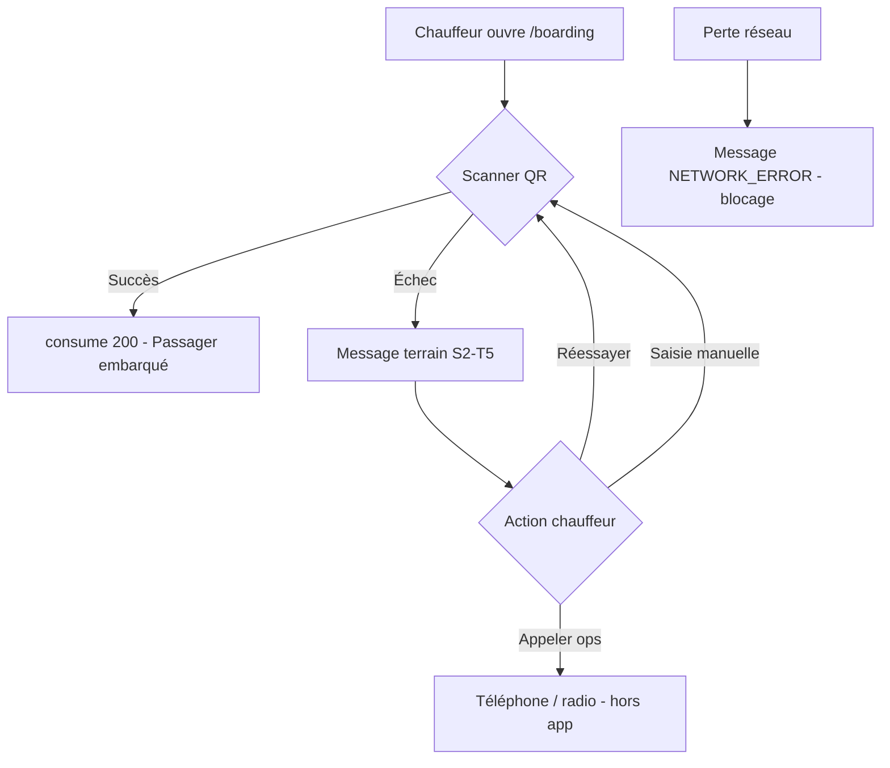
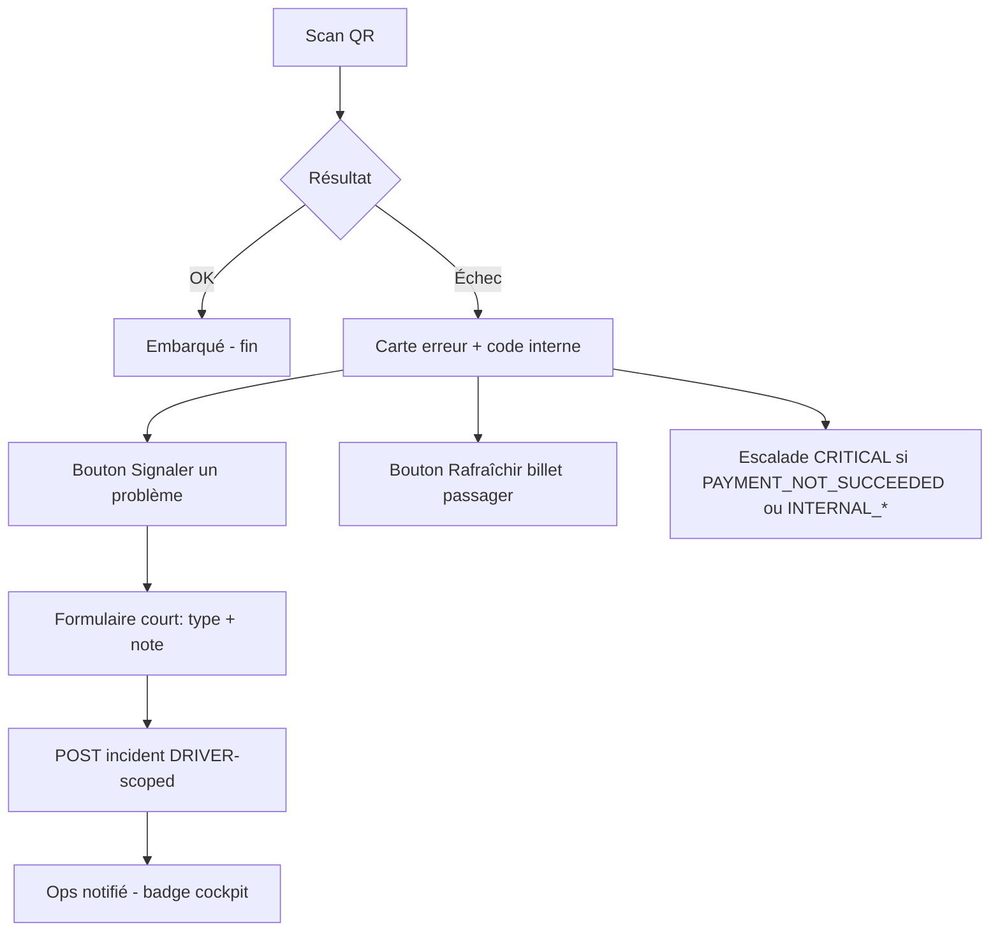
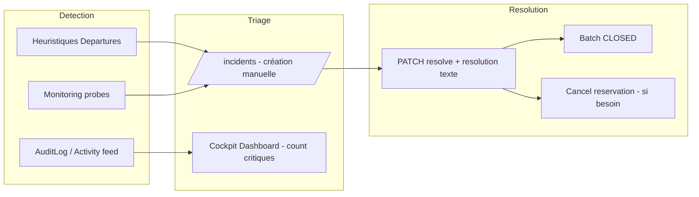

# OPS-02 — Audit fonctionnel gestion incidents terrain

**Ticket :** OPS-02  
**Feature :** OPS-02 — Incident Management  
**Phase BMAD :** OPS (audit only)  
**Date :** 2026-06-19  
**Rôles :** Product Owner · Operations Manager · Senior Backend Architect  
**Prérequis :** moteur boarding validé · OPS-01 clôturé  
**Environnement :** codebase `main` · Postgres · admin cockpit web  
**Verdict :** **Socle incident admin partiellement couvert** — signalement manuel OK · **aucune boucle terrain structurée** · heuristiques Departures non persistées · **DRIVER sans API incident**  
**Code modifié :** aucun  
**Migration :** aucune  
**Commit :** aucun

---

## 1. Résumé exécutif

SharingGO dispose aujourd’hui d’un **registre d’incidents opérationnels persisté** (`Incident` PostgreSQL + API admin CRUD) et d’**alertes heuristiques frontend** sur la console Departures. Le moteur boarding rejette correctement les cas métier (QR invalide, expiré, déjà utilisé, paiement non confirmé, etc.) avec messages terrain (S2-T5).

En revanche, **la gestion d’incident terrain n’est pas un workflow bout-en-bout** :

| Dimension | État actuel | Gap principal |
|-----------|-------------|---------------|
| **Signalement** | Formulaire admin manuel (`/incidents`, liens depuis Monitoring / Departures) | Chauffeur **ne peut pas** créer d’incident (rôle `DRIVER` → boarding uniquement) |
| **Détection** | Heuristiques Departures (6 types, badges UI) | **Non persistées** · pas de lien vers table `Incident` |
| **Boarding** | 12+ codes de rejet + audit `BOARDING_*` | **Aucune escalade** scan échoué → incident |
| **Paiements** | Webhook idempotent + audit `PAYMENT_REJECTED_*` | Pas d’alerte ops structurée · pas de type `PAYMENT` en enum Prisma |
| **Résolution** | `RESOLVED` / `CLOSED` + champ `resolution` optionnel | Pas d’actions métier liées (remboursement, reprogrammation, libération place) |
| **Offline CDC** | `offlineValidation.supported: false` (V1) | **Incident opérationnel majeur** si perte réseau terrain — seulement runbook doc |

**Recommandation CTO (MVP OPS-02) :** ne pas réinventer le ticketing enterprise. **Étendre le modèle `Incident` existant** avec catégories terrain, lien systématique `tripId` / `reservationId`, bouton « Signaler » côté boarding, et **promotion optionnelle** des heuristiques Departures en incidents persistés. Reporter remboursements Stripe, assignation multi-opérateur temps réel et offline sync en V2.

---

## 2. Périmètre analysé

| Zone | Fichiers / artefacts clés |
|------|---------------------------|
| **Schéma DB** | `backend/prisma/schema.prisma` — `Incident`, `Reservation`, `PendingReservation`, `Payment`, `Trip`, `WebhookEvent`, `AuditLog` |
| **API incidents** | `admin-incidents.service.ts`, `admin-incidents.schemas.ts`, `admin.routes.ts` (`/api/admin/incidents*`) |
| **Activity feed** | `admin-activity-feed.service.ts` — fusion `AuditLog` + `Incident` |
| **Departures** | `departure-board.ts` — `computeDepartureIncidents` (heuristiques) |
| **Boarding** | `boarding.consumption.service.ts`, `boarding-eligibility.ts`, `boarding-consumption-reasons.ts`, `boarding-error-messages.ts` |
| **Réservations** | `reservations.service.ts`, `subscription-booking.service.ts`, `admin-reservations.service.ts` (`cancel`) |
| **Paiements** | `stripe-ticket-webhook.service.ts`, `stripe-webhook-idempotency.ts` |
| **Cockpit admin** | `IncidentsPage.tsx`, `IncidentCreateForm.tsx`, `DepartureProgressCard.tsx`, `MonitoringPage.tsx`, `DashboardDispatchSummary.tsx` |
| **Runbooks** | `docs/runbooks/stripe-webhook-failures.md`, `boarding-offline-mode.md`, `ops-health-monitoring.md` |
| **Docs features** | F3-T7, F3-T9, F3-T9-CORRECTION, S2-T5, S2-T6, OPS-01 |

**Hors périmètre audit :** app mobile chauffeur dédiée (V1 = admin web + rôle `DRIVER`), notifications push, remboursements Stripe.

---

## 3. État des lieux — capacités incident existantes

### 3.1 Modèle `Incident` (PostgreSQL)

```prisma
Incident {
  code                 String @unique      // INC-XXXX auto
  title, description?
  type                 IncidentType        // DELAY | TECHNICAL | BEHAVIOR | OTHER
  status               IncidentStatus      // OPEN | IN_PROGRESS | RESOLVED | CLOSED
  severity             IncidentSeverity    // LOW | MEDIUM | HIGH | CRITICAL
  relatedReservationId String?
  relatedTripId        String?
  createdBy            String              // User admin
  resolvedAt?, resolution?
}
```

**Forces :** persistance multi-admin · audit `INCIDENT_CREATED` / `INCIDENT_RESOLVED` · import legacy localStorage · codes stables `INC-XXXX`.

**Limites V1 :**
- Pas de `assignedTo`, `notes[]`, pièces jointes, SLA
- Enum `IncidentType` **trop grossier** (pas de `PAYMENT`, `CAPACITY`, `BOARDING`, `NO_SHOW`)
- `relatedReservationId` exposé API mais **absent du formulaire UI** création
- Pas de FK Prisma vers `Trip` / `Reservation` (IDs libres)
- Fermeture = `CLOSED` via PATCH batch (pas de DELETE physique — conforme sécurité)

### 3.2 API admin incidents

| Méthode | Route | Couverture |
|---------|-------|------------|
| GET | `/api/admin/incidents` | Liste filtrée (status, type, severity, dates) |
| POST | `/api/admin/incidents` | Création manuelle |
| GET | `/api/admin/incidents/:id` | Détail |
| PATCH | `/api/admin/incidents/:id` | Mise à jour / resolve |
| DELETE | `/api/admin/incidents/:id` | Soft close → `CLOSED` |
| POST | `/api/admin/incidents/import-local` | Migration localStorage |

Auth : `ADMIN` / `SUPER_ADMIN` uniquement. **`DRIVER` : 403`**.

### 3.3 Heuristiques Departures (non persistées)

Calcul frontend `computeDepartureIncidents` :

| Kind | Label UI | Severity | Condition |
|------|----------|----------|-----------|
| `near_departure` | Departure soon | info | départ &lt; 15 min |
| `no_passengers` | No passengers | info | readiness `EMPTY` |
| `unknown_readiness` | Unknown readiness | warning | occupancy indisponible |
| `no_boarding_activity` | No boarding activity | warning | occupés &gt; 0, embarqués = 0, proche départ |
| `full_not_boarded` | Full but passengers not boarded | warning | `isFull` et `used &lt; occupied` |
| `boarding_late` | Boarding started late | warning | `now &gt; departureTime` et `confirmed &gt; 0` |

Action UI : lien **« Signaler incident »** → `/incidents?tripId=…&category=departure&create=1` (préremplit type `DELAY` + tripId).

### 3.4 Boarding — codes de rejet (terrain)

| Code backend | Message terrain (prod) | Audit |
|--------------|------------------------|-------|
| `BOARDING_ALREADY_USED` | Passager déjà embarqué | `BOARDING_ALREADY_USED` |
| `RESERVATION_NOT_CONFIRMED` | Passager déjà embarqué (mapping UX) | — |
| `EXPIRED_TOKEN` / `BOARDING_WINDOW_EXPIRED` | Billet expiré | — |
| `INVALID_TOKEN` / `INVALID_TYPE` / `INVALID_PAYLOAD` | QR invalide | — |
| `RESERVATION_NOT_FOUND` | Billet introuvable | — |
| `TOKEN_REVOKED` | Billet révoqué | — |
| `TRIP_DISABLED` | Trajet indisponible | — |
| `PAYMENT_NOT_SUCCEEDED` | Paiement non validé | — |
| `INTERNAL_*` | Erreur technique | `BOARDING_CONSUMPTION_ERROR` |

**Pas de bouton « créer incident »** depuis l’écran boarding. Saisie manuelle JWT disponible (fallback terrain).

### 3.5 Actions correctives admin liées

| Action | API | Limite incident |
|--------|-----|-----------------|
| Annuler réservation | `POST /api/admin/reservations/:id/cancel` | Pas de remboursement V1 · refuse si `USED` |
| — | Pas d’API « forcer embarquement » | — |
| — | Pas d’API « reprogrammer trajet » | — |
| — | Pas d’API « libérer place pending » manuelle | — |

### 3.6 Observabilité transverse

- **Activity feed** : incidents + audit (cap 250/source, pagination mémoire)
- **Dashboard** : compteur incidents ouverts / critiques (`isCriticalOpen`)
- **Monitoring** : lien « Créer incident système » + runbooks
- **Sidebar** : badge count incidents ouverts

---

## 4. Inventaire des scénarios d’incident MVP

Légende **couverture** :
- ✅ **Couvert** — détection ou traitement existant utilisable en ops
- 🟡 **Partiel** — signal possible mais workflow incomplet
- ❌ **Non couvert** — gap à combler OPS-02+

Échelles : **Criticité** P0 (bloquant service) → P3 (cosmétique) · **Fréquence** estimée pilote Châlons↔Vatry (8 trajets/j, ~8 places).

### 4.1 Embarquement (boarding terrain)

| ID | Scénario | Crit. | Freq. | Impact ops | Couverture | Notes actuelles |
|----|----------|-------|-------|------------|------------|-----------------|
| B01 | QR invalide / falsifié | P1 | Occasionnelle | Retard file embarquement | 🟡 | Rejet API + message ; pas d’incident auto |
| B02 | QR expiré (JWT `exp` ou fenêtre départ+10 min) | P1 | Fréquente | Passager doit rafraîchir billet | 🟡 | `BOARDING_WINDOW_EXPIRED` / `EXPIRED_TOKEN` |
| B03 | Billet déjà scanné (double embarquement) | P2 | Fréquente | Confusion chauffeur | ✅ | Idempotence `USED` + UX « déjà embarqué » |
| B04 | Paiement non confirmé (`PAYMENT_NOT_SUCCEEDED`) | P0 | Rare | Fraude / données incohérentes | 🟡 | Rejet boarding ; zombie possible en occupancy (OPS-01) |
| B05 | Réservation annulée / révoquée (`TOKEN_REVOKED`) | P1 | Occasionnelle | Passager refusé | 🟡 | Rejet seul |
| B06 | Trajet désactivé (`TRIP_DISABLED`, `deletedAt`) | P0 | Rare | Tous les billets du créneau invalides | 🟡 | Rejet ; pas d’incident trajet auto |
| B07 | Erreur serveur consume (`INTERNAL_CONSUMPTION_ERROR`) | P0 | Rare | Passagers non enregistrés | 🟡 | Audit `BOARDING_CONSUMPTION_ERROR` ; feed critical |
| B08 | Perte réseau chauffeur (`NETWORK_ERROR`) | P0 | Occasionnelle | **Embarquement impossible** V1 | ❌ | Offline non supporté (CDC futur) ; runbook doc only |
| B09 | Caméra indisponible | P2 | Occasionnelle | Ralentissement | 🟡 | Fallback saisie manuelle token |
| B10 | Passager sans smartphone / QR illisible | P2 | Fréquente | File ralentie | 🟡 | Saisie manuelle ; pas de workflow « valider identité » |
| B11 | Passager sur mauvais créneau / mauvais sens | P1 | Occasionnelle | Place perdue · mécontentement | ❌ | Pas de transfert réservation V1 |
| B12 | Passager agressif / conflit | P1 | Rare | Sécurité équipage | 🟡 | Type `BEHAVIOR` manuel possible |
| B13 | Surbooking perçu (bus affiché plein, passager avec billet valide) | P0 | Rare | Crise terrain | 🟡 | Race webhook possible ; rejet si capacité dépassée à la confirmation |
| B14 | Scan OK mais compteur Departures incohérent | P2 | Occasionnelle | Doute ops | ✅ | OPS-01 : consume ne change pas `occupiedSeats` — doc |
| B15 | Chauffeur non autorisé (mauvais rôle) | P2 | Rare | Blocage 403 | ✅ | RBAC S2-T7 |

### 4.2 Départ & capacité (console Departures)

| ID | Scénario | Crit. | Freq. | Impact ops | Couverture | Notes |
|----|----------|-------|-------|------------|------------|-------|
| D01 | Départ imminent (&lt; 15 min) | P2 | Très fréquente | Vigilance | ✅ | Badge heuristique `near_departure` |
| D02 | Trajet plein, passagers non embarqués | P0 | Occasionnelle | Risque départ incomplet / retard | 🟡 | Heuristique `full_not_boarded` ; signalement manuel |
| D03 | Aucune activité boarding proche départ | P0 | Occasionnelle | Chauffeur absent / app KO | 🟡 | `no_boarding_activity` |
| D04 | Boarding commencé en retard | P1 | Fréquente | Retard chaîne 8 trajets/j | 🟡 | `boarding_late` |
| D05 | Trajet sans passagers (`EMPTY`) | P3 | Fréquente | Optimisation flotte | ✅ | Info seulement |
| D06 | Occupancy API en échec (`UNKNOWN`) | P1 | Rare | Cockpit aveugle | 🟡 | `unknown_readiness` |
| D07 | Retard circulation / panne véhicule | P0 | Occasionnelle | Annulation ou départ tardif | ❌ | Type `DELAY` manuel ; pas de champs retard estimé |
| D08 | Chauffeur absent / remplacement | P0 | Rare | Départ annulé | ❌ | Pas de modèle « remplacement chauffeur » |
| D09 | Capacité 8/8 atteinte, demandes en attente | P1 | Fréquente | Refus réservations | 🟡 | Booking bloqué ; pas d’incident capacité structuré |
| D10 | Pending actifs gonflent « Occupés » | P2 | Fréquente | Confusion compteurs | ✅ | Documenté OPS-01 |
| D11 | Fin de service non modélisée (`CLOSED`) | P2 | Très fréquente | Statut readiness imprécis | ❌ | F3-T7 : futur lifecycle |

### 4.3 Réservations

| ID | Scénario | Crit. | Freq. | Impact ops | Couverture | Notes |
|----|----------|-------|-------|------------|------------|-------|
| R01 | No-show (CONFIRMED, jamais embarqué) | P1 | Fréquente | Place gaspillée · revenu perdu | ❌ | Pas de statut `NO_SHOW` ; reste `CONFIRMED` |
| R02 | Annulation admin passager litige | P1 | Occasionnelle | Libération place | 🟡 | `cancel` API ; **pas de remboursement** |
| R03 | Annulation impossible (déjà `USED`) | P2 | Occasionnelle | Litige | ✅ | 409 `RESERVATION_ALREADY_USED` |
| R04 | Double réservation même user/trajet | P2 | Rare | Redondance | ✅ | Subscription booking rejette duplicate |
| R05 | Pending expiré (2 min) | P2 | Fréquente | UX passager | ✅ | TTL métier ; pas incident |
| R06 | Réservation CONFIRMED sans paiement SUCCEEDED | P0 | Rare (seed/bug) | Occupancy faux | 🟡 | OPS-01 : pas filtré occupancy ; boarding rejette |
| R07 | Transfert vers autre créneau | P1 | Occasionnelle | Satisfaction passager | ❌ | Hors scope V1 |
| R08 | Réservation abonnement sans place | P1 | Occasionnelle | Refus `full` | 🟡 | Audit `SUBSCRIPTION_BOOKING_REJECTED_*` |

### 4.4 Paiements & Stripe

| ID | Scénario | Crit. | Freq. | Impact ops | Couverture | Notes |
|----|----------|-------|-------|------------|------------|-------|
| P01 | Webhook reçu, pending expiré | P1 | Occasionnelle | Client payé, pas de place | 🟡 | `PAYMENT_REJECTED_PENDING_EXPIRED` + FAILED ; runbook Stripe |
| P02 | Webhook reçu, trajet surcapacité | P0 | Rare | Client payé, refus place | 🟡 | `markPaymentFailed` ; **pas remboursement auto** |
| P03 | Pending introuvable au webhook | P1 | Rare | Paiement orphelin | 🟡 | FAILED + audit |
| P04 | Webhook dupliqué | P3 | Occasionnelle | Aucun (idempotent) | ✅ | `webhook_events` |
| P05 | Signature webhook invalide | P0 | Rare | Aucune confirmation | ✅ | `constructEvent` · rejet 400 |
| P06 | Checkout créé, paiement abandonné | P3 | Très fréquente | Aucun impact départ | ✅ | Pending expire |
| P07 | Paiement SUCCEEDED sans `reservationId` | P0 | Rare | Données incohérentes | 🟡 | Log warn `payments-read.service` |
| P08 | Litige remboursement passager | P1 | Occasionnelle | Support manuel | ❌ | `REFUNDED` enum existe · pas de flux |
| P09 | Abonnement `PAST_DUE` / expiré | P1 | Occasionnelle | Refus booking abo | 🟡 | Hors incident structuré |

### 4.5 Système & sécurité

| ID | Scénario | Crit. | Freq. | Impact ops | Couverture | Notes |
|----|----------|-------|-------|------------|------------|-------|
| S01 | API /health ou /ready KO | P0 | Rare | Cockpit + boarding down | 🟡 | Monitoring + incident manuel système |
| S02 | Postgres indisponible | P0 | Rare | Service arrêt | 🟡 | Readiness probe |
| S03 | Stripe webhook endpoint down | P0 | Occasionnelle | Confirmations retardées | 🟡 | Runbook critical billing |
| S04 | Rate limit 429 (auth / API) | P2 | Occasionnelle | Ops / scripts bloqués | ❌ | Pas d’alerte |
| S05 | Fuite secret JWT boarding | P0 | Très rare | Sécurité billet | ❌ | Runbook offline mentionne rotation |
| S06 | Déploiement régression boarding | P0 | Rare | Blocage terrain | 🟡 | Table `deployments` prévue CDC · pas liée incidents |

### 4.6 Passager (impact indirect ops)

| ID | Scénario | Crit. | Freq. | Impact ops | Couverture |
|----|----------|-------|-------|------------|------------|
| X01 | Passager ne peut pas rafraîchir QR (app web KO) | P1 | Occasionnelle | File boarding | 🟡 |
| X02 | Paiement success UI mais pas de réservation | P0 | Rare | Litige | 🟡 |
| X03 | OAuth Google indisponible convoyeur | P1 | Rare | Pas de nouveaux comptes | ❌ |
| X04 | Mosolf : conflit abonnements | P2 | Rare | Booking rejeté | 🟡 |

---

## 5. Synthèse couverture

| Domaine | Total scénarios | ✅ Couvert | 🟡 Partiel | ❌ Non couvert |
|---------|-----------------|-----------|------------|----------------|
| Boarding | 15 | 2 | 10 | 3 |
| Départ & capacité | 11 | 2 | 6 | 3 |
| Réservations | 8 | 3 | 4 | 1 |
| Paiements | 9 | 2 | 6 | 1 |
| Système | 6 | 0 | 5 | 1 |
| Passager | 4 | 0 | 3 | 1 |
| **Total** | **53** | **9 (17 %)** | **34 (64 %)** | **10 (19 %)** |

**Lecture PO :** le produit **protège l’intégrité métier** (boarding, capacité, webhooks) mais **ne capitalise pas** sur ces signaux pour un workflow incident terrain. L’opérateur doit **interpréter** badges Departures + logs audit + créer manuellement un `INC-XXXX`.

---

## 6. Modèle de données recommandé

### 6.1 MVP OPS-02 (évolution minimale du modèle actuel)

**Garder** table `Incident` — ajouter champs et enums (migration future, hors ce ticket) :

| Champ / enum | Recommandation MVP |
|--------------|-------------------|
| `IncidentType` | Ajouter `BOARDING`, `CAPACITY`, `PAYMENT`, `NO_SHOW`, `SAFETY` — conserver anciens pour rétrocompat |
| `source` | `MANUAL` \| `DEPARTURE_HEURISTIC` \| `BOARDING_SCAN` \| `WEBHOOK` \| `MONITORING` |
| `sourceRef` | JSON léger : `{ kind, boardingReason?, auditLogId?, heuristicId? }` — **pas de JWT / PII** |
| `relatedTripId` | **Obligatoire** si incident terrain (sauf `TECHNICAL` global) |
| `relatedReservationId` | Optionnel ; **exposer dans UI** création + préremplissage depuis boarding |
| `assignedToUserId` | Optionnel V1 (nullable) — préparer colonne sans workflow complet |
| `occurredAt` | Horodatage terrain (défaut `createdAt`) |
| `resolution` | **Requis** si `status → RESOLVED` (validation Zod future) |
| `closedReason` | Enum : `FIXED`, `FALSE_ALARM`, `DUPLICATE`, `WONT_FIX` |

**Ne pas ajouter en MVP :** commentaires thread, pièces jointes, SLA tables, sync offline queue.

### 6.2 V2

| Extension | Usage |
|-----------|-------|
| `IncidentEvent` (timeline) | Notes opérateur, changements statut, actions liées |
| `IncidentAction` | Lien vers `RESERVATION_CANCELLED`, refund Stripe, trip disable |
| `DepartureAlert` | Matérialisation périodique heuristiques → incidents si persistance &gt; N min |
| `DriverReport` | Endpoint `POST /api/boarding/incidents` rôle `DRIVER` (titre + tripId + geo optionnel) |
| `NotificationOutbox` | Email / SMS ops pour `CRITICAL` |
| FK Prisma | `relatedTripId` → `Trip`, `relatedReservationId` → `Reservation` (soft) |
| Statut réservation `NO_SHOW` | Clôture opérationnelle post-départ |

---

## 7. Workflow chauffeur recommandé

### 7.1 État actuel V1



Rôle `DRIVER` : `POST /api/boarding/validate|consume` uniquement. **Pas d’accès** `/api/admin/incidents`.

### 7.2 Workflow cible MVP OPS-02



| Étape | Règle métier |
|-------|--------------|
| Signalement | Titre auto prérempli depuis `boardingReason` · `tripId` + `reservationId` injectés serveur |
| Sévérité auto | `INTERNAL_*`, `PAYMENT_NOT_SUCCEEDED`, `TRIP_DISABLED` → `HIGH` minimum |
| Offline | **Ne pas** permettre signalement qui simule un consume · message runbook inchangé |
| Double scan | Pas d’incident — comportement normal |

### 7.3 V2 chauffeur

- File offline scans + sync incidents
- Checklist départ (véhicule, effectif, retard estimé)
- Mode « retard &gt; 15 min » → incident `DELAY` + notification passagers (hors V1 CDC)

---

## 8. Workflow admin recommandé

### 8.1 État actuel V1



### 8.2 Workflow cible MVP OPS-02

| Phase | Acteur | Actions | Outils |
|-------|--------|---------|--------|
| **1. Détection** | Système + ops | Heuristiques → bouton « Promouvoir en incident » · feed audit critical | Departures, Dispatch, Monitoring |
| **2. Triage** | Ops / admin | Filtrer `OPEN` + `CRITICAL` · assigner (optionnel) · lier trip/réservation | `/incidents`, Dashboard |
| **3. Investigation** | Ops | Consulter occupancy, réservation, paiement, audit boarding | Departures, Reservations, Activity |
| **4. Action métier** | Ops | Annuler réservation · créer incident paiement · contacter chauffeur | API cancel existante + runbooks |
| **5. Clôture** | Ops | `RESOLVED` + `resolution` obligatoire + `closedReason` | PATCH incident |
| **6. Revue** | Lead ops | Incidents `CRITICAL` du jour · métriques no-show | Export CSV V2 |

**Règles MVP :**
- Un incident `CRITICAL` ouvert **&gt; 30 min** sur trajet &lt; 1 h → escalade manuelle (process, pas code V1)
- Ne pas dupliquer : si `sourceRef.heuristicId` existe, PATCH existant au lieu de recréer
- Incident paiement litige → toujours lier `relatedReservationId` + lien runbook Stripe

### 8.3 V2 admin

- Remboursement Stripe depuis fiche incident
- Reprogrammation trajet (nouveau `tripId`)
- Règles auto : `no_boarding_activity` &gt; 10 min → incident `HIGH` auto
- Intégration table `deployments` (régression post-release)

---

## 9. Proposition MVP vs V2 (fonctionnel)

### 9.1 MVP OPS-02 (recommandé — 1 sprint produit + 1 sprint tech)

| # | Livrable | Priorité |
|---|----------|----------|
| M1 | Étendre `IncidentType` + champ `source` / `sourceRef` | P0 |
| M2 | UI création : `relatedReservationId` + préremplissage boarding (raison scan) | P0 |
| M3 | Bouton « Promouvoir en incident » sur badges Departures | P1 |
| M4 | Endpoint `POST /api/boarding/field-incidents` (rôle `DRIVER` + admin) | P0 |
| M5 | Validation : `resolution` requise à la résolution | P1 |
| M6 | Activity feed : lier événements `BOARDING_CONSUMPTION_ERROR`, `PAYMENT_REJECTED_*` → suggestion incident | P2 |
| M7 | Fiche runbook OPS-02 dans `docs/runbooks/` (matrice scénarios) | P1 |
| M8 | PRD `docs/prd/active/OPS-02-incident-management.md` | P0 BMAD |

**Hors MVP OPS-02 :** remboursements, NO_SHOW auto, offline sync, notifications push, assignation temps réel.

### 9.2 V2

| # | Livrable |
|---|----------|
| V1 | Statut réservation `NO_SHOW` + job post-départ |
| V2 | `IncidentEvent` timeline + assignation |
| V3 | Auto-incidents persistant depuis heuristiques (seuils temporels) |
| V4 | Remboursement Stripe lié incident |
| V5 | Notifications ops (email/SMS) |
| V6 | Offline boarding + queue incidents terrain |
| V7 | Transfert réservation inter-créneaux |
| V8 | Analytics incidents (MTTR, top codes boarding) |

---

## 10. Recommandations CTO

| Priorité | Recommandation | Justification |
|----------|----------------|---------------|
| **P0** | **Valider PRD OPS-02** avant code — étendre modèle existant, pas nouveau ticketing | F3-T9-CORRECTION déjà livré ; éviter sur-ingénierie constitution |
| **P0** | **Donner au chauffeur un canal de signalement** (API dédiée, pas accès admin complet) | Gap le plus critique terrain ; aujourd’hui téléphone implicite |
| **P0** | **Lier systématiquement incidents ↔ `tripId`** sur ligne unique Châlons↔Vatry | 8 trajets/j — le trip est la clé de regroupement ops |
| **P1** | **Promouvoir heuristiques Departures** en incidents persistés (action manuelle MVP, auto V2) | Évite double saisie · capitalise F3-T7 |
| **P1** | **Exposer `relatedReservationId` dans UI** + préremplissage depuis échec boarding | Résolution plus rapide litiges paiement |
| **P1** | **Durcir occupancy** (`payment.status = SUCCEEDED`) — aligner OPS-01 P2 | Réduit faux positifs `PAYMENT_NOT_SUCCEEDED` terrain |
| **P2** | **`resolution` obligatoire** + enum `closedReason` | Traçabilité audit sans lourdeur |
| **P2** | **Ne pas implémenter offline consume V1** — incident `NETWORK_ERROR` = process + runbook | Conforme CDC « app hors ligne » = futur RS256 |
| **P3** | Retirer import localStorage quand prod stable | Dette F3-T9 |
| **V2** | Remboursement + `NO_SHOW` + notifications | Support client scalable |

**Verdict go/no-go pilote ops :** **GO avec process manuel** (téléphone + `/incidents` + runbooks) · **NO-GO pilote autonome chauffeur** tant que M4 (signalement DRIVER) n’est pas livré.

---

## 11. Matrice rapide — scénarios P0/P1 et action MVP

| ID | Scénario | Action MVP recommandée |
|----|----------|------------------------|
| B04 | Paiement non validé au scan | Incident auto-suggéré `PAYMENT` · vérif DB + cancel si zombie |
| B06 | Trajet désactivé | Incident `DELAY`/`TECHNICAL` lié trip · communication passagers manuelle |
| B07 | Erreur serveur consume | Incident `TECHNICAL` `CRITICAL` depuis boarding |
| B08 | Perte réseau | Process : attendre réseau · pas de contournement · runbook |
| B13 | Surbooking perçu | Vérif occupancy + audit webhook · incident `CAPACITY` |
| D02 | Plein non embarqué | Promouvoir heuristique → incident · contact chauffeur |
| D03 | Pas d’activité boarding | Idem · seuil 10 min (process) |
| D07 | Panne / retard circulation | Incident `DELAY` manuel · note `occurredAt` |
| P01 | Payé, pending expiré | Incident `PAYMENT` + runbook Stripe remboursement manuel |
| P02 | Payé, capacité dépassée | Idem — **critique billing** |
| R01 | No-show | Process : cancel admin post-départ · V2 statut dédié |
| R06 | CONFIRMED sans paiement | Cleanup DB + filtre occupancy (OPS-01) |
| S01 | API down | Incident `TECHNICAL` depuis Monitoring |

---

## 12. Fichiers créés / modifiés

| Fichier | Action |
|---------|--------|
| `docs/qa/OPS-02-incidents-functional-audit.md` | **Créé** |
| Code applicatif | **Aucune modification** |
| Migrations Prisma | **Aucune** |

**Commit :** aucun (conforme au ticket).

---

## 13. Prochaines étapes BMAD (hors scope audit)

1. Rédiger **PRD actif** `docs/prd/active/OPS-02-incident-management.md` (user stories chauffeur + ops).
2. Décision CTO sur **enum `IncidentType`** et API `field-incidents`.
3. Ticket implémentation **MVP M1–M4** après validation PRD + security review.
4. Mettre à jour runbook `boarding-offline-mode.md` avec renvoi vers matrice §4.1 (B08).

---

*Audit réalisé en lecture seule sur codebase SharingGO — juin 2026.*
